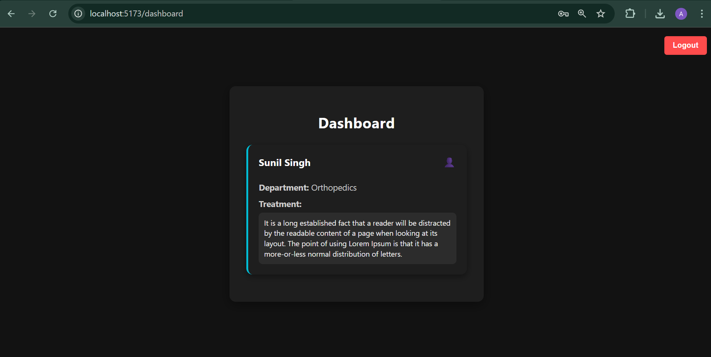

# 🏥 Patient Registration System

A simple, modern frontend-only Patient Registration System built with **React + Vite** and styled using **plain CSS with a dark theme**. Patients can register with details like name, email, password, treatment, and department. Admins can view all registered patients via the dashboard. Includes authentication, validation, and session management.

---

## ✨ Features

- User authentication (Login/Register)
- Patient registration form with details
- Data stored in indexedDB of browser using pglite
- Dashboard to view patient details
- Form validation for email & password
- Support usage in multiple browser tabs
- Session management of user
- No effect of refresh on logged user
- Logout functionality for user

---

## ⚙️ Working of the Website

The Patient Registration website is a frontend-only application built using **React + Vite** and leverages **@electric-sql/pglite** for in-browser storage. Here's a high-level overview of how it works:

1. **Authentication**:
   - Users can register or log in using their email and password.

2. **Form Submission**:
   - Patients fill out a registration form with fields like name, email, treatment details, and department.
   - The treatment field allows multi-line input (textarea), and department is selected from a dropdown.
   - Data is validated for email and password before submission.

3. **Dashboard**:
   - After login, users are redirected to a role-specific dashboard.
   - The dashboard displays relevant user information in styled cards.
   - A logout button allows users to end their session.

4. **Local Storage & Persistence**:
   - All user data is stored in-memory using **pglite**, simulating a local database.
   - This ensures quick data access without backend calls while maintaining a realistic data-handling approach.

---

## 📁 Project Structure

```
project-root/
├── public/
├── src/
│   ├── pages/
|   |   ├── Login.jsx
|   |   ├── Register.jsx
|   |   ├── Dashboard.jsx
|   ├── utils/
|   |   ├──PrivateRoute.jsx
|   |   ├──session.js
│   ├── App.jsx
│   ├── main.jsx
|   ├── auth.js
|   ├── db.js
├── index.html
├── package.json
└── README.md
```

---

## 🚀 Getting Started

### 1. Clone the Repository

```bash
git clone https://github.com/your-username/patient-registration-system.git
cd patient-registration-system
```

### 2. Install Dependencies

```bash
npm install
```

### 3. Run the Development Server

```bash
npm run dev
```

The app should now be running at `http://localhost:5173/` (Vite default port).

---

## 🔀 Routes Overview

| Route        | Description |
|--------------|-------------|
| `/`          | Redirects to `/login` or `/dashboard` based on authentication status. |
| `/login`     | **Login Page** — allows users to log in using email and password. |
| `/register`  | **Registration Page** — new users can sign up by entering their name, email, password, treatment details, and department. |
| `/dashboard` | **Dashboard Page** — displays user information of the current Patients. |

---
## 🧪 Scripts

| Script         | Description               |
|----------------|---------------------------|
| `npm run dev`  | Run local development server |
| `npm run build`| Build the app for production |
| `npm run preview` | Preview production build locally |

---

## 🛠️ Built With

- [PGLite](https://pglite.dev/)
- [React](https://reactjs.org/)
- [Vite](https://vitejs.dev/)
- Plain CSS (Dark Theme)

---

## 📸 Preview




---

## ⚠️ Challenges Faced

### Local-only Data Handling:
Implementing local data handling using @electric-sql/pglite without a backend was tricky, especially for authentication and role-based access.

### Validation Handling:
Ensuring good UX with inline validation for email/password formats while keeping logic lightweight.


---

## 📚 Things Learned

- How to set up a React project using **Vite** for fast development.
- Building **authentication flows** without a backend, using in-browser state and local storage.
- Using **@electric-sql/pglite** to simulate local database functionality.
- Creating **protected routes** and managing user sessions effectively.
- Enhancing UI with **custom styling** and **dark themes**.
- Handling user input with validation for secure and clean data collection.
- Structuring components for **modularity and reusability**.

This project solidified core React concepts while offering insight into building full-featured applications that feel dynamic even without a traditional backend.

 ---

 ## ✅ Conclusion

This project provided a hands-on experience in building a **frontend-only patient registration system** with modern React features and local data persistence using **@electric-sql/pglite**. It demonstrates how user authentication, conditional rendering, form handling, and role-based access can be efficiently managed in a single-page application.

The user interface was designed to be clean and responsive, with a dark theme to improve user experience. Admin and patient roles were clearly separated, ensuring proper data visibility and access control.

---
